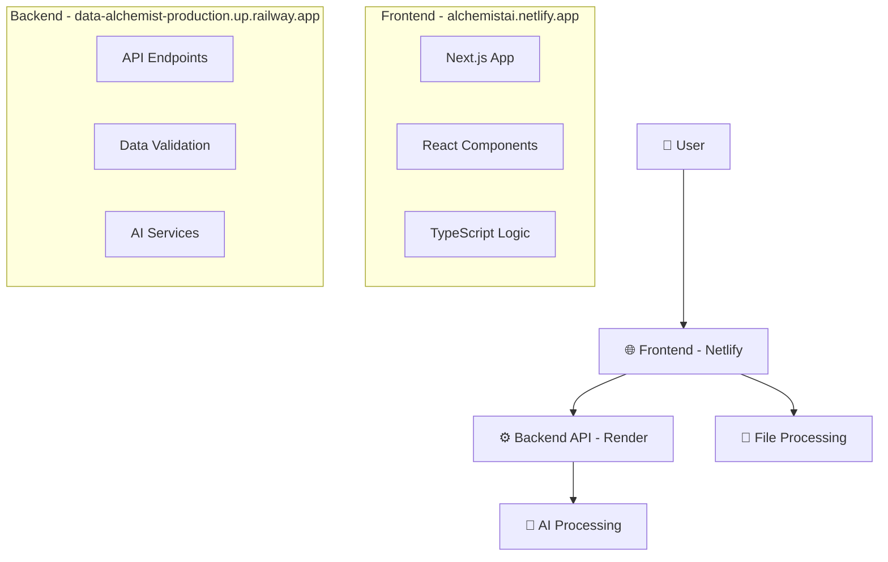
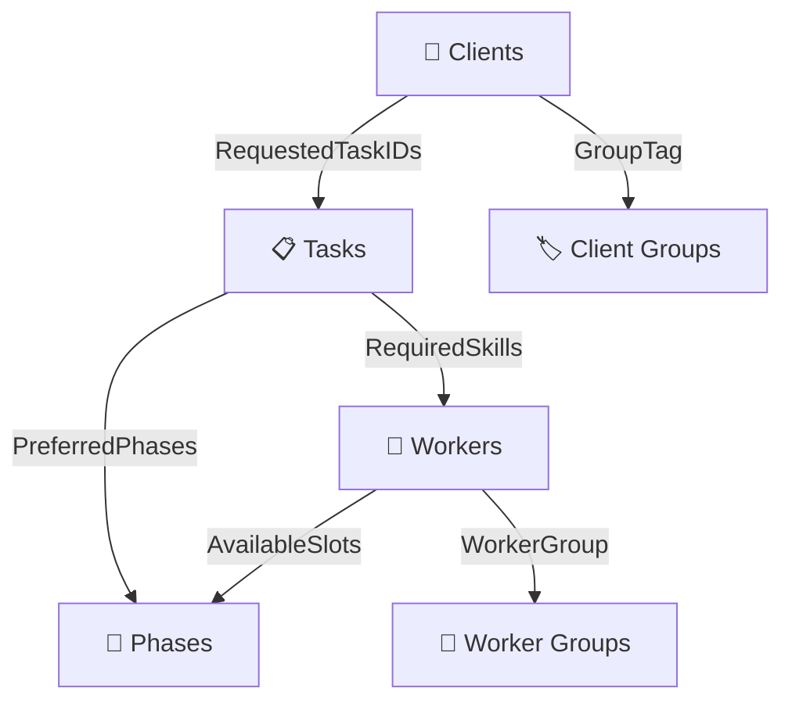

# 🚀 Data Alchemist: AI-Powered Resource Allocation Configurator

<div align="center">


*Transform chaotic spreadsheet data into organized, validated, rule-based resource allocation configurations*

### 🌐 Live Demo & Links

[](https://www.youtube.com/watch?v=USbGn_R0Jq0)
[](https://alchemistai.netlify.app/)
[](https://data-alchemist-production.up.railway.app)

</div>

---

## 🎥 See It In Action

**👉 [Watch the full demo video](https://www.youtube.com/watch?v=USbGn_R0Jq0)** to see Data Alchemist transform messy spreadsheets into clean, validated data configurations.

## 🌐 Try It Live

- **🚀 Frontend Application**: [alchemistai.netlify.app](https://alchemistai.netlify.app/)
- **⚙️ Backend API**: [data-alchemist-production.up.railway.app](https://data-alchemist-production.up.railway.app)

The demo video includes all the functions.
---

## 📖 The Story

Once upon a time, teams were lost in tangles of spreadsheets—client lists here, worker details there, and task plans everywhere. We needed a hero to bring order out of chaos. **Enter the Data Alchemist: an AI-powered solution that transforms data chaos into organizational gold.**

## 🎯 Mission Overview

**Data Alchemist** is an intelligent Next.js web application that empowers non-technical users to:

- 📁 **Upload messy spreadsheets** (CSV/XLSX) with confidence
- 🤖 **AI-validate data** with intelligent error detection and correction
- 🔧 **Build business rules** using natural language
- ⚖️ **Configure priorities** with intuitive controls
- 📤 **Export clean data** ready for downstream processing

### ✨ Core Features

| Feature | Description | AI Enhancement |
|---------|-------------|----------------|
| 📊 **Smart Data Grids** | Interactive tables with real-time editing | Intelligent column mapping |
| ✅ **Advanced Validation** | 8+ validation types with error flagging | Natural language error explanations |
| 🔧 **Rule Builder** | Visual rule creation interface | English-to-rule conversion |
| ⚖️ **Priority Controls** | Customizable weight sliders | Smart recommendation engine |
| 🔍 **Natural Search** | Query data using plain English | AI-powered query interpretation |
| 📤 **Export System** | Clean CSV + rules.json output | Optimized for downstream tools |

---

## 🌟 The Magic Workflow

**Think of it as an intelligent spreadsheet superhero for non-technical users.**


1. **🔍 Upload**: Drop in your raw CSV or Excel files
2. **🤖 AI Check**: System instantly identifies mistakes and shows warnings
3. **🔍 Search**: Find data using natural language queries
4. **✏️ Fix**: Correct problems directly in the table with one click
5. **📝 Rules**: Type rules in plain English - AI converts them automatically
6. **⚖️ Prioritize**: Use sliders to balance costs, speed, and other factors
7. **✅ Export**: Download clean CSV files + rules.json when everything is validated

---

## 🏗️ System Architecture

### 🌐 Deployment Architecture



### 1. 📥 Data Ingestion
Transform messy data into organized information:
- **Multi-format Support**: CSV and XLSX file handling
- **Smart Parsing**: AI-enabled parser that maps incorrectly named headers
- **Interactive Grids**: Editable data tables with inline validation
- **Real-time Feedback**: Immediate error detection and correction

### 2. ✅ Validation & Error Correction
Comprehensive data validation system:

| Validation Type | Description | Status |
|----------------|-------------|--------|
| 🔍 **Missing Columns** | Detect required column absence | ✅ Core |
| 🆔 **Duplicate IDs** | Find duplicate ClientID/WorkerID/TaskID | ✅ Core |
| 🔢 **Malformed Lists** | Validate numeric fields in AvailableSlots | ✅ Core |
| 📊 **Range Validation** | Check PriorityLevel (1-5), Duration (≥1) | ✅ Core |
| 📋 **JSON Validation** | Validate AttributesJSON format | ✅ Core |
| 🔗 **Reference Integrity** | Verify RequestedTaskIDs exist in tasks | ✅ Core |
| 🔄 **Circular Dependencies** | Detect A→B→C→A loops in co-run groups | ✅ Core |
| ⚔️ **Rule Conflicts** | Find conflicting rules vs constraints | ✅ Core |

### 3. 🔧 Rule Builder Interface
Create business rules without technical complexity:
- **🤝 Co-run Rules**: Tasks that must execute together
- **🚪 Slot Restrictions**: Minimum common slots for groups
- **⚖️ Load Limits**: Maximum slots per phase for worker groups
- **📅 Phase Windows**: Allowed phases for specific tasks
- **🎯 Pattern Matching**: Regex-based rule templates

### 4. ⚖️ Prioritization & Weights
Fine-tune allocation preferences:
- **🎚️ Sliders**: Adjust weights for PriorityLevel, fulfillment, fairness
- **🔄 Drag & Drop**: Reorder criteria by importance
- **📊 Pairwise Comparison**: AHP (Analytic Hierarchy Process) matrix
- **📋 Preset Profiles**: "Maximize Fulfillment", "Fair Distribution", "Minimize Workload"

---

## 📊 Data Structure

### 👥 Clients (`clients.csv`)
```csv
ClientID, ClientName, PriorityLevel, RequestedTaskIDs, GroupTag, AttributesJSON
```
- **PriorityLevel**: Integer (1-5) 
- **RequestedTaskIDs**: Comma-separated TaskIDs
- **AttributesJSON**: Arbitrary JSON metadata

### 👷 Workers (`workers.csv`)
```csv
WorkerID, WorkerName, Skills, AvailableSlots, MaxLoadPerPhase, WorkerGroup, QualificationLevel
```
- **Skills**: Comma-separated skill tags
- **AvailableSlots**: Array of phase numbers `[1,3,5]`
- **MaxLoadPerPhase**: Integer capacity limit

### 📋 Tasks (`tasks.csv`)
```csv
TaskID, TaskName, Category, Duration, RequiredSkills, PreferredPhases, MaxConcurrent
```
- **Duration**: Number of phases (≥1)
- **RequiredSkills**: Comma-separated skill requirements
- **PreferredPhases**: List or range `"1-3"` or `[2,4,5]`
- **MaxConcurrent**: Maximum parallel assignments

### 🔗 Data Relationships



---

## 🚀 Quick Start

### 🌐 Try Online (Recommended)
1. **Visit**: [alchemistai.netlify.app](https://alchemistai.netlify.app/)
2. **Upload**: Your CSV/XLSX files
3. **Validate**: Let AI check your data
4. **Configure**: Set rules and priorities
5. **Export**: Download clean, validated files

### 💻 Local Development

#### Prerequisites
- Node.js 18+
- npm or yarn

#### Installation
```bash
# Clone the repository
git clone https://github.com/yourusername/data-alchemist.git
cd Data_Alchemist

# Navigate to frontend
cd frontend

# Install dependencies
npm install

# Start development server
npm run dev
```

### 📁 Project Structure
```
Data_Alchemist/
├── 📁 frontend/             # Next.js application
│   ├── 📁 app/             # Next.js app directory
│   ├── 📁 components/      # React components
│   ├── 📁 lib/             # Core utilities
│   ├── 📁 hooks/           # Custom React hooks
│   ├── 📁 samples/         # Example CSV/XLSX files
│   └── 📁 public/          # Static assets
├── 📁 backend/             # API services (deployed on Render)
└── 📄 README.md           # This file
```

### 🧪 Sample Data

Find example files in the `/frontend/samples` folder:
- `clients.csv` - Sample client data with various scenarios
- `workers.csv` - Worker profiles with diverse skills
- `tasks.csv` - Task definitions with different complexities

---

## 🤖 AI Capabilities

### Core AI Features
1. **🧠 Smart Data Parsing**: Handles incorrectly formatted headers
2. **🔍 Natural Language Search**: "Show tasks with duration > 2 phases"
3. **✨ Error Correction**: Suggests and applies data fixes
4. **📝 Rule Generation**: Converts English to business rules
5. **💡 Pattern Recognition**: Identifies data relationships
6. **🎯 Recommendations**: Suggests optimizations

### AI Enhancement Examples
- **Column Mapping**: Automatically maps "Client_Name" to "ClientName"
- **Natural Queries**: "Find workers with Python skills in phases 1-3"
- **Rule Translation**: "Tasks T12 and T14 should always run together" → Co-run rule
- **Error Explanation**: "Priority level 6 is invalid. Valid range is 1-5."

---

## 🎨 User Experience

### 🎯 Target Persona
**Non-technical users** who need to:
- Clean messy spreadsheet data
- Validate complex business rules
- Export organized data for downstream tools

### 🌟 Key Features
- **Intuitive Interface**: No technical knowledge required
- **Smart Suggestions**: AI-powered recommendations
- **Visual Feedback**: Clear error indicators and success states
- **One-Click Fixes**: Automated error correction
- **Natural Language**: Plain English commands and queries

---

## 📤 Export & Integration

### Output Files
- **📊 Clean Data**: Validated CSV files for clients, workers, tasks
- **⚙️ Rules Configuration**: Complete `rules.json` with all business logic
- **📋 Validation Report**: Summary of corrections and validations

### Export Features
The [`ExportSection`](frontend/components/ExportSection.tsx) component provides:
- **Batch Download**: All files exported simultaneously
- **Progress Tracking**: Real-time export status
- **File Management**: Download individual files or complete packages
- **Export History**: Track previous exports with timestamps

### Ready for Downstream
The exported files are optimized for:
- Resource allocation algorithms
- Project management tools
- Scheduling systems
- Capacity planning tools

---

## 🛠️ Development Milestones

### ✅ Milestone 1: Foundation
- ✅ Data Ingestion & Parsing
- ✅ Core Validations (8+ types)
- ✅ Interactive Data Grids
- ✅ **AI Feature**: Natural Language Data Retrieval

### ✅ Milestone 2: Intelligence
- ✅ Rule Builder Interface
- ✅ Prioritization Controls
- ✅ **AI Feature**: Natural Language Rule Converter

### ✅ Milestone 3: Deployment
- ✅ Frontend Deployment (Netlify)
- ✅ Backend API Deployment (Railway)
- ✅ Demo Video Production
- ✅ Live Application Testing

### 🎯 Milestone 4: Advanced AI
- 🔄 Natural Language Data Modification
- 🔄 AI Rule Recommendations
- 🔄 AI-based Error Correction
- 🔄 Advanced AI Validator

---

## 🏆 Success Metrics

- ✅ **Data Quality**: 100% validation coverage
- ⚡ **Performance**: Real-time validation feedback
- 🤖 **AI Accuracy**: 95%+ rule conversion success
- 👥 **User Experience**: Non-technical user friendly
- 🚀 **Export Ready**: Clean, structured output files
- 🌐 **Live Deployment**: Fully operational web application

---

## 🔧 Configuration

### Deployment Configuration
- **Frontend**: Deployed on Netlify with automatic builds
- **Backend**: Deployed on Railway with API endpoints
- **Domain**: Custom domain setup for production use

### Next.js Configuration
The project uses a custom [`next.config.mjs`](frontend/next.config.mjs) with:
- ESLint bypass for builds
- TypeScript error tolerance
- Unoptimized images for development

### Environment Setup
```bash
# Development
npm run dev

# Production build
npm run build
npm start

# Linting
npm run lint
```

---

## 🤝 Contributing

We welcome contributions! Please follow these guidelines:

### Development Process
1. Fork the repository
2. Create a feature branch
3. Make your changes
4. Add tests for new features
5. Submit a pull request

### Code Standards
- TypeScript for type safety
- ESLint for code quality
- Prettier for formatting
- Component-based architecture

### AI Model Improvements
- Enhance natural language processing
- Improve rule conversion accuracy
- Add new validation types
- Expand error correction capabilities

---

## 📞 Support

Need help? Check out:
- 🎬 [Demo Video](https://www.youtube.com/watch?v=USbGn_R0Jq0)
- 🚀 [Live Application](https://alchemistai.netlify.app/)
- 📚 [Documentation](./frontend/README.md)
- 🐛 [Issue Tracker](https://github.com/yourusername/data-alchemist/issues)
- 💬 [Discussions](https://github.com/yourusername/data-alchemist/discussions)

---

## 📄 License

This project is licensed under the MIT License - see the [LICENSE](LICENSE) file for details.

---

<div align="center">

**Built with ❤️ for the data-driven future**


*Transform your data chaos into organizational gold* ✨

**🎬 [Watch Demo](https://www.youtube.com/watch?v=USbGn_R0Jq0) | 🚀 [Try Live App](https://alchemistai.netlify.app/)**

</div>
