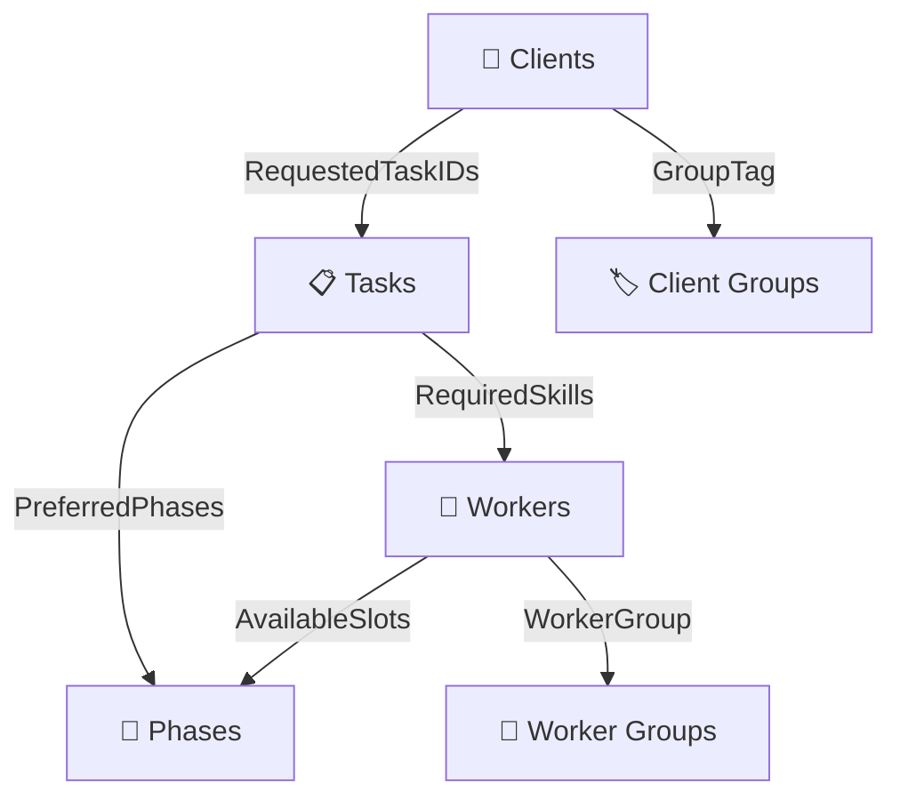

# 🚀 Data Alchemist: AI-Powered Resource Allocation Configurator

<div align="center">


</div>

## 📖 The Story

Once upon a time, our team was lost in a tangle of spreadsheets—client lists here, worker details there, and task plans everywhere. We needed a hero to bring order out of chaos. **That's where you come in: you are the Data Alchemist.**

---

## 🎯 Mission Overview

Build an **AI-enabled Next.js web application** that transforms chaotic spreadsheet data into organized, validated, and rule-based resource allocation configurations.

### ✨ Core Features

- 📁 **Smart File Upload**: CSV or XLSX files for clients, workers, and tasks data
- 📊 **Interactive Data Grids**: Easily editable grids with real-time error fixing
- ✅ **AI-Powered Validation**: Intelligent data validation with error flagging
- 🔧 **Business Rule Builder**: Create complex business rules with ease
- ⚖️ **Priority Controls**: Balance different needs with customizable priorities
- 📤 **Export Ready**: Clean data and rules.json files for downstream processing

---

## 🌟 Use Case Summary

**Think of it as an intelligent spreadsheet superhero for non-technical users.**

### The Magic Workflow:
1. 🔍 **Upload**: Drop in your raw CSV or Excel files
2. 🤖 **AI Check**: System instantly identifies mistakes and shows warnings
3. 🔍 **Search**: Find data using natural language queries
4. ✏️ **Fix**: Correct problems directly in the table with one click
5. 📝 **Rules**: Type rules in plain English - AI converts them automatically
6. ⚖️ **Prioritize**: Use sliders to balance costs, speed, and other factors
7. ✅ **Export**: Download clean CSV files + rules.json when everything is validated

---

## 🏗️ System Architecture

### 1. 📥 Data Ingestion

Transform messy data into organized information:

- **Multi-format Support**: CSV and XLSX file handling
- **Smart Parsing**: AI-enabled parser that maps incorrectly named headers
- **Interactive Grids**: Editable data tables with inline validation
- **Real-time Feedback**: Immediate error detection and correction

> **🤖 AI Enhancement**: Intelligent column mapping even with wrong headers or rearranged data

### 2. ✅ Validation & Error Correction

#### Core Validations (Target: 8+ validations)

| Validation Type | Description | Status |
|----------------|-------------|--------|
| 🔍 **Missing Columns** | Detect required column absence | ✅ Core |
| 🆔 **Duplicate IDs** | Find duplicate ClientID/WorkerID/TaskID | ✅ Core |
| 🔢 **Malformed Lists** | Validate numeric fields in AvailableSlots | ✅ Core |
| 📊 **Range Validation** | Check PriorityLevel (1-5), Duration (≥1) | ✅ Core |
| 📋 **JSON Validation** | Validate AttributesJSON format | ✅ Core |
| 🔗 **Reference Integrity** | Verify RequestedTaskIDs exist in tasks | ✅ Core |
| 🔄 **Circular Dependencies** | Detect A→B→C→A loops in co-run groups | ✅ Core |
| ⚔️ **Rule Conflicts** | Find conflicting rules vs constraints | ✅ Core |
| 👥 **Worker Overload** | Check AvailableSlots vs MaxLoadPerPhase | 🎯 Bonus |
| 📅 **Phase Saturation** | Validate task durations per phase | 🎯 Bonus |
| 🛠️ **Skill Coverage** | Ensure every skill has qualified workers | 🎯 Bonus |
| 🚀 **Concurrency Check** | Validate MaxConcurrent feasibility | 🎯 Bonus |

> **🤖 AI Enhancements**: 
> - Advanced validation engine for complex data relationships
> - Natural language error explanations
> - Smart correction suggestions with one-click fixes

### 3. 🔧 Rule Builder Interface

Create business rules without technical complexity:

#### Rule Types
- **🤝 Co-run Rules**: Tasks that must execute together
- **🚪 Slot Restrictions**: Minimum common slots for groups
- **⚖️ Load Limits**: Maximum slots per phase for worker groups
- **📅 Phase Windows**: Allowed phases for specific tasks
- **🎯 Pattern Matching**: Regex-based rule templates
- **🏆 Precedence Override**: Priority-based rule ordering

> **🤖 AI Enhancement**: Natural language to rules converter - "Tasks T12 and T14 should always run together" → Auto-generated co-run rule

### 4. ⚖️ Prioritization & Weights

Fine-tune allocation preferences:

#### Interface Options
- **🎚️ Sliders**: Adjust weights for PriorityLevel, fulfillment, fairness
- **🔄 Drag & Drop**: Reorder criteria by importance
- **📊 Pairwise Comparison**: AHP (Analytic Hierarchy Process) matrix
- **📋 Preset Profiles**: "Maximize Fulfillment", "Fair Distribution", "Minimize Workload"

---

## 📊 Data Structure

### 👥 Clients (`clients.csv`)
```
ClientID, ClientName, PriorityLevel, RequestedTaskIDs, GroupTag, AttributesJSON
```
- **PriorityLevel**: Integer (1-5) 
- **RequestedTaskIDs**: Comma-separated TaskIDs
- **AttributesJSON**: Arbitrary JSON metadata

### 👷 Workers (`workers.csv`)
```
WorkerID, WorkerName, Skills, AvailableSlots, MaxLoadPerPhase, WorkerGroup, QualificationLevel
```
- **Skills**: Comma-separated skill tags
- **AvailableSlots**: Array of phase numbers `[1,3,5]`
- **MaxLoadPerPhase**: Integer capacity limit

### 📋 Tasks (`tasks.csv`)
```
TaskID, TaskName, Category, Duration, RequiredSkills, PreferredPhases, MaxConcurrent
```
- **Duration**: Number of phases (≥1)
- **RequiredSkills**: Comma-separated skill requirements
- **PreferredPhases**: List or range `"1-3"` or `[2,4,5]`
- **MaxConcurrent**: Maximum parallel assignments

### 🔗 Data Relationships



---

## 🛠️ Development Milestones

### 🎯 Milestone 1: Foundation
- ✅ Data Ingestion & Parsing
- ✅ Core Validations (8+ types)
- ✅ Interactive Data Grids
- 🤖 **AI Feature**: Natural Language Data Retrieval

### 🎯 Milestone 2: Intelligence
- ✅ Rule Builder Interface
- ✅ Prioritization Controls
- 🤖 **AI Feature**: Natural Language Rule Converter

### 🎯 Milestone 3: Advanced AI
- 🤖 Natural Language Data Modification
- 🤖 AI Rule Recommendations
- 🤖 AI-based Error Correction
- 🤖 Advanced AI Validator

---

## 🚀 Quick Start

### Prerequisites
- Node.js 18+
- npm or yarn

### Installation
```bash
# Clone the repository
git clone <repository-url>
cd data-alchemist

# Install dependencies
npm install

# Start development server
npm run dev
```

### 📁 Project Structure
```
data-alchemist/
├── 📁 app/                 # Next.js app directory
├── 📁 components/          # React components
├── 📁 lib/                 # Core utilities
├── 📁 hooks/               # Custom React hooks
├── 📁 samples/             # Example CSV/XLSX files
└── 📁 public/              # Static assets
```

---

## 🧪 Sample Data

Find example files in the `/samples` folder:
- `clients.csv` - Sample client data with various scenarios
- `workers.csv` - Worker profiles with diverse skills
- `tasks.csv` - Task definitions with different complexities

---

## 🎨 User Experience

### 🎯 Target Persona
**Non-technical users** who need to:
- Clean messy spreadsheet data
- Validate complex business rules
- Export organized data for downstream tools

### 🌟 Key Features
- **Intuitive Interface**: No technical knowledge required
- **Smart Suggestions**: AI-powered recommendations
- **Visual Feedback**: Clear error indicators and success states
- **One-Click Fixes**: Automated error correction
- **Natural Language**: Plain English commands and queries

---

## 🤖 AI Capabilities

### Core AI Features
1. **🧠 Smart Data Parsing**: Handles incorrectly formatted headers
2. **🔍 Natural Language Search**: "Show tasks with duration > 2 phases"
3. **✨ Error Correction**: Suggests and applies data fixes
4. **📝 Rule Generation**: Converts English to business rules
5. **💡 Pattern Recognition**: Identifies data relationships
6. **🎯 Recommendations**: Suggests optimizations

---

## 📤 Export & Integration

### Output Files
- **📊 Clean Data**: Validated CSV files for clients, workers, tasks
- **⚙️ Rules Configuration**: Complete `rules.json` with all business logic
- **📋 Validation Report**: Summary of corrections and validations

### Ready for Downstream
The exported files are optimized for:
- Resource allocation algorithms
- Project management tools
- Scheduling systems
- Capacity planning tools

---

## 🏆 Success Metrics

- ✅ **Data Quality**: 100% validation coverage
- ⚡ **Performance**: Real-time validation feedback
- 🤖 **AI Accuracy**: 95%+ rule conversion success
- 👥 **User Experience**: Non-technical user friendly
- 🚀 **Export Ready**: Clean, structured output files

---

## 🤝 Contributing

We welcome contributions! Please see our contributing guidelines for:
- Code standards
- Testing requirements
- AI model improvements
- Documentation updates

---

## 📞 Support

Need help? Check out:
- 📚 [Documentation](./docs)
- 🐛 [Issue Tracker](./issues)
- 💬 [Discussions](./discussions)

---

<div align="center">

**Built with ❤️ for the data-driven future**


</div>
